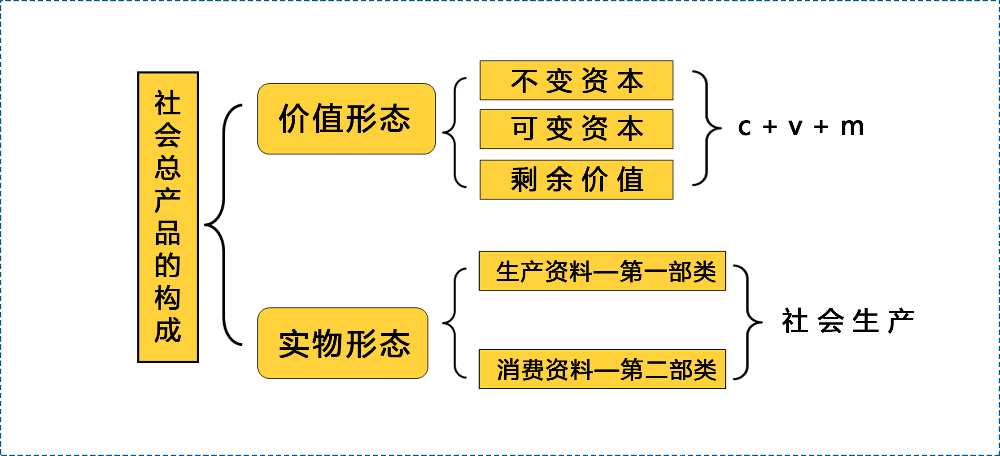

> 公共基础课（必修）
## 第1章 绪论-走进马克思主义
1. 走进马克思-马克思是顶天立地的伟人
1. 走进马克思-马克思是有血有肉的常人
1. 马克思主义的创立和发展
1. 马克思主义与中国

### 走进马克思-马克思是顶天立地的伟人
1835年，17岁的马克思，高宗毕业作文很好表达了为人类而工作的志向，高中毕业论文题目，《青年在选择职业时的考虑》。

## 第2章 感受世界的多样性和物质的统一性
1. 什么是物质观
1. 物质的存在形态
1. 意识的本质与特征
1. 哲学的基本问题

列宁的经典物质定义:物质是标志(*客观实在*)的哲学范畴,它是人通过感觉感知的,它不依赖我们的感觉而存在,为我们的感觉所复写、摄影、反映。

辩证唯物主义认为,意识不过是人脑的一种(*机能*)。

物质运动是绝对的，静止是相对的，静止也不过是运动的一种形式。

黑格尔是一个客观唯心主义者。

在现实生活中，我们要坚持辩证唯物主义，既要*反对机械的唯物论*，又要*反对主观的唯心主义*。
*机械的唯物主义*不考虑现实条件的变化性，因循守旧，墨守成规，不思进取，容易形成教条主义和本本主义，从而影响各项工作的顺开展；
*主观唯心主义*夸大主观因素的作用，忽略客观现实的制约性，容易形成冒进主义和主观主义，从而妨碍各项事业的正常推进。

## 第3章 认识马克思的唯物主义辩证法
1. 辩证法的秘密
1. 中西方不同的辩证智慧
1. 辩证法的科学形态：唯物主义辩证法
1. 唯物主义辨证法的总观点和总特征

(*唯物辩证法*)是客观物质世界的发展规律和认识发展规律的正确反映。
与辩证法相对立的思维形态是(*形而上学*)。

《老子》提到的“有无相生,难易相成,长短相形,高下相倾,声音相和、前后相随”是一种辩证唯物主义思想。（**错误**）

## 第4章 理解唯物辩证法的内容与特征
1. 联系和发展的基本环节
1. 规律之一：对立统一
1. 规律之二：质量互变
1. 规律之三：否定之否定

矛盾的(*普遍性*)就是指矛盾存在于一切事事物的发展过程中,每一种事物的发展过程中存在着自始至终的矛盾运动,也就是说矛盾无所不在,无时不有。

对立统一就是事物内部包含着相互联结、相互依存、相互渗透、相互转化,又相互排斥、相互分离、相互否定相互斗争的方向和倾向。(**正确**)

度是事物质和量的统一,是事物保持自己质的数量界限、范围或节点。(**正确**)

种子——植株——种子是一个否定之否定的过程。（**正确**）

## 第5章 运用唯物辩证法认识和改造世界
1. 唯物辩证法是人民群众的思想武器
1. 开启智慧的辩证思维能力
1. 通达情势的历史思维能力
1. 提升格局的战略思维能力
1. 知晓分寸的底线思维能力
1. 追求变革的创新思维能力

【判断题】辩证唯物主义深刻揭示了自然、社会和人类思维发展的普遍规律,在当今时代依然有着强大生命力,为我们提供了科学的世界观和方法论。(**正确**)

【判断题】“辩证法唯物论是无产阶级的精神武器”,这是毛泽东同志对马克思主义哲学力量的高度概括。(**正确**)

【单选题】(**辩证思维能力**)是指从事物相互联系、相互作用的关系出发,承认矛盾、分析矛盾、解决矛盾,善于抓住关键、找准重点、洞察事物发展规律的能力。
*辩证思维能力是唯物辩证法在思维中的运用*

【单选题】当生产力水平达到一定程度时,生产关系必然会发生改变,社会主义必将代替资本主义,这是一种(**历史唯物主义**)的判断。

【判断题】历史、现实和未来具有相通性,历史是过去的现实,现实是未来的历史,历史可以任由今人进行解读,历史是一种主观的思考产物。(**错误**)

【单选题】(**战略思维能力**)是指从全局视角和长远眼光把握事物发展总体趋势和方向、客观辩证地思考和处理问题的科学思维能力。

【单选题】下列*不属于*战略思维能力的内容是( *举一反三* )。
- 高瞻远瞩
- 谋定后动
- 运筹帷幄

【单选题】底线思维能力是一种、追求精准、强化预判性以及()的能力。

认识底线思维，要从以下几个方面入手：
- 追求精准
- 强化预判性
- 提高积极性

【判断题】底线思维就是根据我们的现实需要和客观条件,划清并坚守界限,尽力化解风险,避免最坏结果,同时争取实现最大期望值的一种积极的思维。(**正确**)

## 第6章 人的认识从何而来？
1. 作为认识基础的实践是什么？
1. 任何理解实践和认识的关系？

【单选题】李时珍尝遍百草,终成《百草纲目》的案例说明:(*实践是认识的源泉* )。

【单选题】科学实践观的创立者是(*马克思* )。

【判断题】实践主体是人。(*错误*)

【判断题】实践客体并非所有的客观存在。(*正确*)

【判断题】实践推动了认识的发生,并使认识成为现实。（ *正确* ）

【单选题】“纸上得来终觉浅,绝知此事要躬行。”这句话所体现的认识论原理是()。

【单选题】实践是检验真理的唯一标准,是因为()。

【判断题】逻辑证明作为思维的必要表达方式,不能完全取代实践标准在真理检验中的作用。（）

## 第7章 任何理解人的认识？
1. 认识的本质是什么？
1. 人的认识是如何行程的？
1. 怎样把握认识运动的过程及趋势？

【单选题】下列哲学家坚持唯物主义反映论认识路线的是(*费尔巴哈*)。

【单选题】认识的本质是(*客观存在的主观映像*)。
> 马克思主义认为，认识的本质是主体在实践基础上对客体的能动反映。

【判断题】先验论和反映论是唯心主义和唯物主义在认识论问题上的根本分歧。（*正确*）

【单选题】关于感性认识和理性认识的关系,说法错误的是()。

关系：
- 感性认识有待于发展和深化为理性认识
- 理性认识依赖于感性认识
- 感性认识和理性认识相互渗透

【单选题】认识过程最重要的阶段是(*从认识到实践*)。

【判断题】从感性认识到理性认识的飞跃需掌握丰富且合乎实际的感性材料。（*正确*）

【判断题】从认识到实践的复归意味着认识运动的终结。（*错误*）

【单选题】认识的运动过程是(*螺旋式上升过程*)。

【单选题】关于认识运动的无限性和有限性的观点错误的是(*任何人...*)。

认识运动的反复性束缚了认识的无限性。(*错误*)

## 第8章 怎样把握真理与价值及其统一？
1. 什么是真理
1. 什么是价值
1. 怎样把握真理与价值的辩证统一？

### 什么是真理

### 绝对性和相对性
**真理的绝对性**是指真理主客观统一的确定性和发展的无限性

### 真理的内涵
从概念上来讲，真理是标志主观与客观相符合的哲学范畴，是对客观事物及其规律的正确反映。

### 真理与谬误
真理和谬误是人类认识中的一对永恒矛盾，它们之间既对立又统一。

第一，真理与谬误相互对立。

第二，真理与谬误的对立又是相对的。

真理和谬误的对立统一关系表明，真理总是同谬误相比较而存在、相斗争而发展的。

【单选题】真理的绝对性是指()。

【单选题】真理和谬误的关系不包括()。

【判断题】真理是标志主观与客观相符合的哲学范畴,是对客观事物及其规律的正确反映。(*正确*)

【判断题】我们要坚持马克思主义普遍真理,与各种错误社会思潮作斗争。(*正确*)

### 怎样把握真理与价值的辩证统一？
真理尺度是指在实践中人们必须遵循正确反映客观事物本质和规律的真理，即按规律办事。

【单选题】真理尺度不能理解为(*真理是唯一原则*)。

【单选题】真理尺度和价值尺度的关系不包括(*相互对立*)。

【判断题】马克思主义实现了合规律性与合目的性的统一,是真理尺度与价值制度的完美结合。（*正确*）

## 第9章 如何正确认识与改造世界？
1. 什么是认识世界和改造世界
1. 认识世界和改造世界的基本遵循是什么？
1. 何以推动认识世界和改造世界的发展？
1. 青年大学生如何再认识和改造世界中实现自我？

### 什么是认识世界和改造世界
【单选题】认识世界和改造世界的关系不包括()。
- A、认识世界有助于改造世界
- B、改造世界能够深化和拓展对世界的认识
- *C、改造世界能够独立于认识世界*
- D、认识世界和改造世界是一个矛盾的过程

【单选题】改造主观世界和改造客观世界的关系不包括()。
- A、只有认真改造主观世界,才能更好地改造客观世界
- B、只有在改造客观世界的实践中,才能深入改造主观世界
- C、改造主观世界的核心是改造世界观,提升改造客观世界的能力
- *D、改造客观世界成功了,主观世界自然改造完善*

【判断题】改造客观世界,也改造自己的主观世界。(*正确*)

## 第10章 “历史之谜”是怎样破解？
1. 哲学世界里的历史观
1. 马克思破解“历史之谜”的过程
1. 唯物史观的基本范畴
1. 唯物史观创立的重要意义

## 第11章 历史发展的动力是什么？
1. 为什么社会基本矛盾是社会历史发展的根本动力
1. 阶级斗争和社会革命在阶级社会发展中的作用
1. 改革、科技在社会发展中的作用

## 第12章 怎样看待历史发展的基本趋势？
1. 社会形态的内涵及其类型
1. 社会形态更替的一般规律及特殊形式
1. 社会形态更替的必然性与人们的历史选择性

## 第13章 谁是历史的创造者？
1. 唯物史观产生前的不同历史观及其缺陷
1. 为什么说人民群众是历史的创造者？
1. 个人在社会历史中有何作用，如何评价？

## 第14章 商品质和量的规定性
1. 商品和商品的二因素
1. 劳动的二重性
1. 私有制条件下简单商品经济的基本矛盾
1. 商品的价值量

### 商品和商品的二因素

#### 什么是商品
商品是用来交换、能满足人的某种需要的劳动产品。

商品首先应该是劳动产品；其次，用来交换的劳动产品，才是商品。

#### 商品的二因素：
- 价值
- 使用价值

*价值是商品所特有的社会属性*，商品交换实际上是商品生产者之间相互交换劳动的关系，因此，商品的价值在本质上体现了生产者之间一定的社会关系。

## 第15章 货币和价值规律
1. 货币是怎样产生的？
1. 货币形式的发展
1. 货币有哪些职能？
1. 价值规律的内容和作用

## 第16章 剩余价值的生产
1. 资本的总公式及其矛盾
1. 劳动力商品
1. 剩余价值的生产过程
1. 不变资本和可变资本
1. 生产剩余价值的两种基本办法
1. 资本的有机构成

### 资本的总公式及其矛盾
1. 总公式：`G——W——G’`
1. 资本就是指能够带来（*剩余价值*）的价值。
1. 劳动力成为商品，是货币转化为资本的前提，也是解决资本总公式矛盾的钥匙。（正确）

### 劳动力商品
1. 劳动力成为商品的两个条件，除了劳动者没有任何生产资料和生活资料,还有（*劳动者是自由人*）。
1. 劳动力商品的价值还原为，是有维持劳动者生存和发展所必须的（*生活必需品*）的价值决定的。
1. 所有劳动力都是商品。（x错误）

### 剩余价值的生产过程
资本主义生产具有二重性：
- 一方面它是物质资料的生产过程，
- 另一方面它是生产剩余价值的过程，即价值增值过程。

#### 劳动过程
劳动过程，也就是物质资料过程，包括三个基本要素：
- 劳动者的劳动
- 劳动对象
- 劳动资料

资本主义劳动过程的要素都为资本家所占有，决定了资本主义劳动过程的两个特点：
其一，工人在资本家的监督下劳动，它们的劳动隶属于资本家；
第二，劳动的成果或者产品全部归资本家所有。

#### 价值增值过程
剩余价值是指，由雇佣工人所创造的并被资本家无偿占有的**超过劳动力价值**的那部分价值，体现了**资本家与工人间剥削与被剥削**的关系。

在剩余价值的生产过程中，工人的劳动时间分为了两段，一段是必要劳动时间，也就是再生产劳动力价值的时间。

### 不变资本和可变资本
> 在生产剩余价值中的作用划分
**不变资本**是指，以生产资料形态存在的资本。通常用字母 `c` 来表示。

**可变资本**是指，用来购买劳动力的那部分资本。通常用字母 `v` 来表示。

#### 划分的依据和意义
第一，揭示了剩余价值的真正来源。剩余价值是雇佣工人的劳动创造的。
第二，为考察资本家对雇佣劳动者的剥削程度提供了科学依据，即剩余价值率（剩余价值与可变资本的比率。计算公式：`m'=m/v`）。

### 生产剩余价值的两种基本办法
一、绝对剩余价值的生产

**绝对剩余价值**是指，在必要劳动时间不变的前提下，由于工作日的绝对延长而生产的剩余价值。

二、相对剩余价值的生产

**相对剩余价值**是指，在工作日长度不变的条件下，通过缩短必要劳动时间而相对延长剩余劳动时间所生产的剩余价值。

### 资本的有机构成
预付资本
- 物质形态（技术构成）
    - 生产资料
    - 劳动力
- 价值形态 （价值构成）
    - 不变资本
    - 可变资本

按照物质形态来考察，资本主要用于购买生产资料和劳动力。购买生产资料和劳动力，无论从质的方面还是量的方面都要保持一定的比例关系。
比如：技术水平越高，生产资料所占的比重就越大。随着生产力提高，有机构成也不断提高。

## 第17章 资本流通理论与经济危机
1. 产业资本的循环
1. 产业资本的周转
1. 社会资本再生产
1. 经济危机的实质与根源

### 产业资本得循环
#### 产业资本循环的三个阶段
1. 购买阶段
1. 生产阶段
1. 售卖阶段

第一个阶段是**购买阶段**，即生产资料与劳动力的购买阶段。也就是资本家拿出一定数量的货币资本来，购买商品，这个商品包括生产资料和劳动力。
`G`代表货币资本，`W`代表商品，所购买的商品包括劳动力，用`A`表示；生产资料，用`Pm`表示。
在购买阶段，资本执行的是*货币资本*的职能，所起到的作用就是为生产价值和剩余价值做准备。

第二个阶段是**生产阶段**，生产资料与劳动者相结合，生产出新的商品。
资本是以各种生产要素的形式存在的，资本的形态就是*生产资本*，所起到的作用就是，生产出价值和剩余价值。

第三个阶段是**售卖阶段**，就是把新生产出来的商品卖出去，把钱收回来。
 `W’` 代表新生产出来的商品，`G’` 代表回收的资本，要比第一阶段的 `G` 大，要发生增值。
资本采取的是*商品资本*的形态，所起到的作用是，实现价值和剩余价值。

#### 产业资本循环顺利进行的条件
第一，必须产业资本三种职能形式在空间上的并存性。

第二，必须产业资本三种职能形式的转化在时间上的继起性。

产业资本的循环，只有保持了空间上的并存性和时间上的继起性，才能使得循环顺利进行。

### 产业资本的周转
周转时间
- 流通时间
    - 购买时间
    - 售卖时间
- 生产时间
    - 劳动时间
    - 非劳动时间
        - 生产得周期性中断时间 （*生产过程中工人必要的吃饭睡觉，休息的时间。机器必要的检修时间。*）
        - 自然力作用于劳动对象得时间 （*部分的商品的生产有，比如水稻等*）
        - 生产资料的储备时间 (*一般生产资料购买来就开始计算了*）

非劳动时间虽然算生产时间，但本身并产生价值，所以作为生产者总是要想办法缩短这部分时间。

#### 周转速度
一年内，如果周转的次数越多，说明周转速度越快，周转次数越少，说明周转次数越买。*资本速度与周转时间成反比，与资本周转次数成正比。*

#### 固定资本和流动资本
> 根据资本不同部分在生产剩余价值中的作用不同，把资本划分为不变资本和可变资本。根据资本的周转方式不同，把资本划分为固定资本和流动资本。
预付资本
- 不变资本
    - 劳动资料 （固定资本）
    - 劳动对象 （流动资本）
- 可变资本
    - 劳动力 （流动资本）

### 社会资本再生产
#### 社会资本
社会资本是指相互练习、相互依存的个别资本的总和。

#### 社会总产品
社会总产品指的是，社会各物质生产部门，在一定时期内（通常为一年）所生产的全部物质资料的总和。如图：

#### 考察社会资本再生产的核心问题
社会总产品的实现包括两层含义：价值补偿和实物替换。

### 经济危机的实质与根源
#### 经济危机的实质
生产相对过剩，比如相对于老百姓的购买能力，买不起了。

#### 经济危机的根源
（1）经济危机的抽象一般的可能性。

是由货币作为流通手段和支付首手段引起的。

（2）资本主义经济危机爆发的根本原因

资本主义的基本矛盾，就是生产资料资本主义私人占有制和社会化大生产的矛盾。
第一，生产无限扩大的趋势与劳动人民有支付能力的需求相对缩小的矛盾；
第二，单个企业内部生产的有组织性和整个社会生产的无政府状态之间的矛盾。

## 第18章 利润和剩余价值是什么关系
1. 剩余价值转化为利润
1. 利润转化为平均利润
1. 价值转化为生产价格

### 剩余价值转化为利润

### 利润转化为平均利润

**平均利润率**是指，社会剩余价值总量和社会预付总资本的比率。

公式：`平均利润率 = 社会剩余价值总额 / 社会预付资本总额 X 100%`

**平均利润**是指，一定量的预付资本，根据平均利润获得的利润。

公式：`平均利润 = 预付资本 X 平均利润率`

平均利润率的形成，最简单地说就是不同部门资本家竞争的结果。

第一步，等量资本获得不等量利润

第二步，竞争和资本的自由转移

第三步，等量资本获得等量利润

### 价值转化为生产价格

**生产价格**是指*生产成本*加*平均利润*。

### 生产价格没有违背价值规律

生产价格形成以后，商品不再按照价值出售，而是按照生产价格出售。市场价格围绕着生产价格波动，不再围绕价值上下波动。

一、从全社会看，整个资本家阶级获得的利润总额与雇佣工人所创造的剩余价值总额是相等的。

二、从个别部门看，商品的生产价格同价值不一致，但从全社会来看，商品的生产价格总额和价值总额相等。

三、生产价格的变动归根取决于商品价值的变动。

## 第19章 垄断资本主义
1. 私人垄断资本主义
1. 国家垄断资本主义

## 第20章 你了解经济全球化吗
1. 什么是经济全球化
1. 经济全球化的影响
1. 经济全球化与中国
1. 推动经济全球化朝着合作共赢方向发展

## 第21章 当代资本主义的新变化
1. 二战后资本主义新变化
1. 2008年国家金融危机依赖资本主义的矛盾与冲突

## 第22章 资本主义的历史地位
1. 如何看待资本主义的历史地位
1. 资本主义为社会主义所替代替的历史必然性

## 第23章 社会主义五百年的历史进程
1. 社会主义是如何从空想变成科学的？
1. 社会主义是如何从理想变成现实的？
1. 社会主义从一国到多国
1. 社会主义在中国焕发出强大生机活力

[单选] 空想社会主义“提供了启发工人觉悟的极为宝贵的材料”，但不具备（*科学的品格*）

A. 科学的品格
B. 实践的力量
C. 现实的意义
D. 创新的品格

## 第24章 在实践中探索现实社会主义的发展规律
如何看待经济文化相对落后国家建设社会主义的长期性？
如何认识社会主义发展道路的多样性？
为什么说社会主义是在实践探索中开拓前进的？

## 第25章 共产主义崇高理想及其最终实现
什么是共产主义？
为什么说共产主义的实现是历史发展的必然趋势？
树立共产主义远大理想与中国特色社会主义共同理想